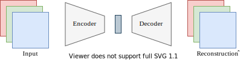

# **0** Back Propagation
上标表示层号,下标表示数据序号.  
First Input:  $ x_i^0 $  
Linear Output : $ z_i^p $  
Activation Output/Linear Input: $ x_i^p $  
Final Output: $ \hat{y} = x_i^l$  
Cost:   $ c = \frac{1}{N}\underset{i}{\Sigma}L(y_i,x_i^l) $其中L()是损失函数  
## Forward 
$$
z_i^1=W^1x_i^0+b^1  \quad  \quad x_i^1 = f^1(z_i^1) \\ 
\ldots \quad    \ldots \\ 
z_i^p=W^px_i^{p-1}+b^p \quad  \quad x_i^p = f^p(z_i^p) \\ 
\ldots \quad    \ldots \\ 
z_i^{p+1}=W^{p+1}x_i^p+b^{p+1} \quad  \quad x_i^{p+1} = f^{p+1}(z_i^{p+1}) \\ 
\ldots \quad    \ldots \\ 
z_i^l=W^lx_i^{l-1}+b^l \quad  \quad x_i^l = f^l(z_i^l) \\ 
$$
## Backward
$$
目标： \frac{\partial c}{\partial x^{l}}=\frac{1}{N}\underset{i}{\Sigma}\frac{\partial L}{\partial x^{l}}
$$
$$
\frac{\partial L}{\partial b^p}
=
\frac{\partial f^p(z^p)}{\partial z^p}
\cdot
\frac{\partial L}{\partial x^p}
$$
$$
\frac{\partial L}{\partial W^p}=
\frac{\partial L}{\partial z^p} (x^{p-1})^T=
\left(
\frac{\partial f^p(z^p)}{\partial z^p}
\cdot
\frac{\partial L}{\partial x^p}
\right)
(x^{p-1})^T
$$
$$
\frac{\partial L}{\partial x^p}
=
(W^{p+1})^T
\frac{\partial f^{p+1}(z^{p+1})}{\partial z^{p+1}}
\frac{\partial L}{\partial x^{p+1}}
$$
$$
\frac{\partial L}{\partial x^{l}}=L'(x^{l}, y)
$$
$$
注意,实际上所有的\frac{\partial f^p(z^p)}{\partial z^p} \quad 都只是f^p的一阶导函数 (f^p)'
$$
#  **1** Hello World
> --------------------------- Requirements ---------------------------  
torch                   2.5.1+cu121  
torchvision             0.20.1+cu121   
matplotlib              3.10.8  
CUDA(on my machine)     12.9

> 本节的目标是实现一个xor的分类器   
为了使数据更复杂一些,这里的xor的data不只是(0,0) (0,1) (1,0) (1,1)这四个点,是以(0,0) (0,1) (1,0) (1,1)这四个点为中心,radius为半径随机的生成一些点  
## Pytorch Basic  
1. **数据集** 它指明了数据是什么 此处通过程序化生成,需要继承`Dataset` 并且重写 `__getitem__` 和 `__len__`这两个方法    
2. **模型**  需要继承`nn.Module`并且重写`forward`方法  
3. **DataLoader**  它指明了数据怎样喂给训练过程  
4. **nn.Module** 理解成一个输入tensor输出tensor的函数
5. **epoch**     表示把数据集完整的过一边。 
## Pytorch Tensor
- b==7, 是把index为7的位置都置为1。生成如[False,True,False,False,True]的tensor
- a[mask], mask is like[False,True,False,False,True]。它的作用是取a的第2个和第5个元素(结果的size是2)。
- a[idx], idx is like[1,4]。同上
- 注意 a[[0,1,0,0,1]]和上式不等价！
## Torch Scatter  
- scatter_softmax(src) 返回的维度和src的维度相同
- scatter_add(src,index,dim,dim_size) 返回的维度和dim_size相同
## Pytorch Best Pratice
- 很多关于维度的参数，能用-1,-2就用-1,-2。而不是硬编码，因为有时候会忘记Batch这一个维度，导致你认为的dim不正确
- LOGGER记录loss一定要用.item()!!!!!!
# **2** Miscellaneous Topics
## Activation Functions
1.  $\sigma(x) = \frac{1}{1 + e^{-x}}$  
2. $\tanh(x) = \frac{e^x - e^{-x}}{e^x + e^{-x}}$  
3. $\text{ReLU}(x) = \max(0, x)$
4. $
\text{LeakyReLU}(x) = 
\begin{cases} 
x & x > 0 \\
\alpha x & x \le 0
\end{cases}
$
5. $
\text{ELU}(x) = 
\begin{cases} 
x & x > 0 \\
e^x - 1 & x \le 0
\end{cases}
$  
6. $\text{Swish}(x) = x \cdot \sigma(x)$  
## Normalization
先举一个简单的例子 $x_1,x_2,...x_n \in \mathcal{R} \quad \mu:=mean; \sigma:=std$  
那么我有两个可学习的参数,$\mu',\sigma'$  
forward时 
$$ z = \frac{x- \mu}{\sigma} $$
$$ y = \sigma'z+\mu' $$
对于不同的normalization,他们的区别主要是，计算mean/std的维度和数量，可学习参数的维度(利用广播)和数量
### Batch Normalization
如果某一层的激活函数之前的输入是(线性层之前的输出)是(m,n)  
其中m是batch中样本的数量,n是一个样本中特征的数量  
注意下面不同的i其实是batch中不同的样本  
$ \mu_B = \frac{1}{m}\sum_{i=1}^{m} x_i $  
$ \sigma_B^2 = \frac{1}{m}\sum_{i=1}^{m}(x_i - \mu_B)^2 $  
$ \hat{x}_i = \frac{x_i - \mu_B}{\sqrt{\sigma_B^2 + \epsilon}} $  
$ y_i​=γ\hat{x}_i​+β  $  
其中γβ是可学习参数,维度是(n)  
在推理时,没有batch的概念。$ \mu_B\quad\sigma_B $ 是训练时累计的 running mean / var     
### Layer Normalization
batch norm是不同样本之间同一个特征位置的normalization  
layer norm是同一个样本不同特征位置的normalization   
如数据的shape是 (B,C,H,W)  
Batch Normalization 会产生C个均值方差   
Layer Normalization 会产生B个均值方差      
一般CNN用batch norm,时序用layer norm. (这可以认为是实践总结得到的)  
# **3** CNN
- 结构总览:在图像的cnn里,输入的图像大小(这里不考虑batch)是(800,600,3),一般随着层数的增加,长宽维度会减小,而通道维度会增大。比如某一个中间层是(20,16,192),最终会是(1,1,1000).最后会跟着一个全连接层。    
- 优化器:动量sgd和adam都可以尝试。其中resnet可以用sgd。scheduler可以用MultiStepLR  ,它在指定的epoch降lr  
- Epoch number 数量级大概是100
## [GoogleNet](https://arxiv.org/pdf/1409.4842) 
是由如下的几个Inception模块堆叠而成的  
$$Inception$$

- 可以看到最后有concatenation操作,所以这四路的图片的长和宽要一致。所以3x3 5x5的那些层的padding要给'same'(pytorch自动计算出整数值以保证在stride为1的情况下长宽不变).  
- 别忘了在卷积层之后接BatchNorm之后再接激活函数  
$$Google Net$$

此网络可以分为3部分  
1. 第一个Inception之前。卷积层降尺寸
2. Inceptions. 期间穿插max pool降尺寸
3. 最后一个Inception之后。avg pool降到1x1.之后紧跟全连接。
## [ResNet](https://arxiv.org/pdf/1512.03385) 
对于隐藏层,res net之前的cnn: $y = F(x)$  
而res net:$ y = F(x) + x $  
其中，F(x)可以是一系列的conv maxpool avg relu等等     
所以,res net要求 x的shape(C,H,W)和F(x)的是相同的  
如果Shape不同，则 x可以过一个1x1 Conv再与F(x)相加(尺寸不同就调整stride)。此时，$ y = F(x) + W_sx $  
_上述的线性层应该尽量避免，只在迫不得已的情况下才加_
$$ResNet Block$$
  
注:图中的|weight|表示Linear层  
res net有不同的变种,左边是初代res net。左右的最大区别在于激活函数的位置。  
$$ResNet$$
|    |  |
|--------|-----|
| 正如GoogleNet是Inception的串联 ResNet也是ResNetBlock的串联 其中,彩色的block表示发生了H,W的缩小(可以在第一个Linear层缩小)。      | 此图是resnet论文的真实例子 可以看到，每当图片尺寸H,W÷2时，通道数C就✖2。其他时候F(x)的(H,W,C)和x的是一致的  | 
## [DenseNet](https://arxiv.org/pdf/1608.06993) 
$$DenseNet Block$$
  
dense net比起res net更加激进，它在每一层的输出上都concatenate了之前各个层的输出。由于它是concat的(与res net的Add不同),它只要求输出的(H,W)与输入一致。即
$$\mathbf{x}_\ell = H_\ell \big( [\mathbf{x}_0, \mathbf{x}_1, \ldots, \mathbf{x}_{\ell-1}] \big)$$
超参数k={12,24,40...}  
Dense Net Layer: 即$H_\ell$的结构是BN-ReLU-Conv(1×1,4k)-BN-ReLU-Conv(3×3,k)  
Dense Block:由多个$H_\ell$串联而成  
Transition Layer:降低尺寸, Conv(1x1)-Avg(2x2,stride 2)
$$DenseNet$$
  
注意,Dense Net是先BN再Conv的，这点和一般的CNN很不同。  
所以input net(表格第一行Conv)的结构不是Conv-BN-ReLU,而是一个Conv.  
Classification net的结构也应该是BN起手的    
总之其他层的网络结构随着核心层的结构而变化  
# **4** [Transformer](https://arxiv.org/pdf/1706.03762) 
## Attention
Input $ (n \times d_m) $ (after position encoding) ：  $ \begin{bmatrix} x_1  \\ x_2 \\ x_3 \\ \vdots \\ x_T \end{bmatrix} $  
待学习的参数QKV三个矩阵  $\quad W^Q(d_m \times d_k) \quad W^K(d_m \times d_k) \quad W^V(d_m \times d_v) $  
分别与Sequence相乘  
| $Q(n \times d_k) $ |$K(n \times d_k) $ |$V(n \times d_v) $  |  $QK^T  (n \times n) $  |
|----------------|-------------------|------------|-------------|
|$ \begin{bmatrix} x_1^q  \\ x_2^q  \\ \vdots \\ x_n^q \end{bmatrix} $ |$ \begin{bmatrix} x_1^k  \\ x_2^k  \\ \vdots \\ x_n^k \end{bmatrix} $|$ \begin{bmatrix} x_1^v  \\ x_2^v  \\ \vdots \\ x_n^v \end{bmatrix} $|$ \begin{bmatrix} x_1^qx_1^{kT} & x_1^qx_2^{kT} & \dots x_1^qx_n^{kT} \\ x_2^qx_1^{kT} & x_2^qx_2^{kT} & \dots x_2^qx_n^{kT} \\   \vdots  &  \vdots  &  \vdots  \\ x_n^qx_1^{kT} & x_n^qx_2^{kT} & \dots x_n^qx_n^{kT} \end{bmatrix} $|  

$QK^T/=\sqrt{d_k}$    
对$QK^T$的每一行做softmax。
$\alpha_{1j} = \frac{x_1^qx_j^{kT}}{\sum_j e^{x_1^qx_j^{kT}}  }$  
Output $ (n \times d_v) \quad Output_i(第i行)= \sum_{j=1}^{n} A_{ij} \cdot x_j^v $.  
【ALL IN ALL】 $ Attention(Q,K,V) = softmax(\frac{QK^T}{\sqrt{d_k}})V  $  
|Attention Data Flow|Multi-head Attention|
|--|------|
|||

对于多头注意力,设待学习的QKV矩阵有h组,每一组的输出维度是$d_v$,h组拼接在一起就是$hd_v$。  
为了和输入维度$d_m$一致，需要最后加一个Linear层(如右图最上面的Linear层，即使$hd_v=d_m$)来对齐输入维度
## Scale
这里来讲讲为啥有$\sqrt{d_m}$的缩放。  
已知，对于独立分布的变量X,Y。有$D(XY) = D(X)D(Y) + D(X)[E(Y)]^2 + D(Y)[E(X)]^2$  
现在假设Q的每一行是 $(q_1,q_2,...,q_{d_k})  \quad q_i \sim \mathcal{N}(0,1)$  
现在假设K的每一列是 $(k_1,k_2,...,k_{d_k})  \quad k_i \sim \mathcal{N}(0,1)$  
则点成是 $\Sigma_i q_ik_i  \sim \mathcal{N}(0,d_k)$
## 位置编码
$PE_{(pos,i)} =
\begin{cases}
\sin\left( \frac{pos}{10000^{i/d_{model}}} \right), & \text{if } i \bmod 2 = 0 \\
\cos\left( \frac{pos}{10000^{(i-1)/d_{model}}} \right), & \text{otherwise}
\end{cases}$  
$i \in [0,d_{model-1}] \quad pos \in [0,n-1]$
## Encoder

整个encoder模块只有一个激活函数,在Feed Forward里  
原文章这样描述:$\text{FFN}(x) = \max\big(0, \, x W_1 + b_1 \big) W_2 + b_2$  
这里的Linear作用在每一个token上(shape:$d_m \rightarrow d_h$),第二个Linear需要把shape再转回来(以做残差连接)  
LayerNorm是对每个token做的
## 优化器和调度器  
Epoch number 数量级大概是10  
优化器可以用adam
调度器分为两个方面，分别是warm up+ cosine decay
warm up: iteration 0->M   ==>  learning rate: 一个很小的值-->优化器的设定值  
decay: iteration M->N  ==> learning rate:优化器的设定值-->一个很小的值  
具体来说:  
$warmup_{factor}=\frac{i}{M}$  
$decay_{factor} = 0.5*(1+cos(\frac{\pi i}{N}))$  
注意，iteration的单位是batch iteration(而不是epoch)  
# **5** GNN
> 图信息(edge index/dense/sparse joint matrix)一般在forward里给  
数据集里的train_mask表示整个图里被训练的node.如果它的邻居不在train mask里,这个邻居也会被更新feature vector,只不过在最终计算loss时只使用train nodes.
## [GAT](https://arxiv.org/pdf/1710.10903)  
Nodes           $\quad\quad\quad\quad(v_1,v_2,...,v_n)$  
Feature Vectors  $\quad(\mathbf{x_1},\mathbf{x_2},...,\mathbf{x_n}) \quad \mathbf{x} \in \mathbb{R}^F $  
learnable parameters $ \mathbf{W}_{F^{'}\times F} \quad  \mathbf{a}_{2F^{'}}$  
$$
\alpha_{ij} = \frac{
e^{\sigma(\mathbf{a}^T \,[\mathbf{Wx_i}\,\|\, \mathbf{Wx_j}])
}}{
\sum_{k \in \mathcal{N}_i}
e^{\sigma(\mathbf{a}^T \,[\mathbf{Wx_i}\,\|\, \mathbf{Wx_k}])
}} \quad; \sigma= LeakyReLU
$$
$$ \tilde{x_i} =  \sum_{j \in \mathcal{N}_i} Dropout(\alpha_{ij}) \mathbf{W} x_j\quad;
$$
-------------------------如果有k个multi-head-------------------------  
learnable parameters $ \mathbf{W}_1,\mathbf{W}_2,...\mathbf{W}_k \quad  \mathbf{a}_1,\mathbf{a}_2,...\mathbf{a}_k$  
中间层 *(拼接)*
$$
x_i'= \sigma[\tilde{x}_{i1} \,\| \tilde{x}_{i2}' \,\| ...\,\| \tilde{x}_{ik}']  \in \mathbb{R}^{kF'} $$
output层 *(先平均再激活)*
$$ x_i'= \sigma(\frac{\sum_{j=1}^k\tilde{x}_{ij} }{k})  \in \mathbb{R}^{F'}$$
但是一般在工程实现中，GAT Layer一般不加最后的这个激活函数，这个激活函数会放在此Layer的外面。
### Node Level Task
input : $x (N,d_{in})$  
output: $(N,n_{class})$  
[GAT,Relu,Dropout, GAT,Relu,Dropout,......, GAT  ] 
### Graph Level Task  
input : $x (N,d_{in}) \quad  batch (N)$  
output: $(B,n_{class})$  
[GAT,Relu,Dropout, GAT,Relu,Dropout,......,avg_pool(N,d_out==>B,d_out), Dropout,fc  ] 

## TODO: GIN
# **6** EBM
## 最大似然估计
1. intuition: 数据 $x$ 已知（已经观测到了），寻找哪种参数 $\theta$ 最能解释这些数据。  
最大似然估计（MLE） 的目标就是：通过调整模型参数 $\theta$，使得观测到现有样本数据的“可能性”（即似然函数值）达到最大。  
2. 有一组独立同分布（i.i.d.）的样本 $X = \{x_1, x_2, \dots, x_n\}$，其概率密度函数为 $f(x|\theta)$。由于样本是独立的，联合概率分布可以写成各项概率的乘积：$$L(\theta) = L(\theta; x_1, \dots, x_n) = \prod_{i=1}^{n} f(x_i | \theta)$$通常对似然函数取自然对数，将乘法变为加法：$$\ell(\theta) = \log L(\theta) = \sum_{i=1}^{n} \log f(x_i | \theta)$$由于 $\log$ 函数在定义域内是单调递增的，使得 $\ell(\theta)$ 最大的 $\theta$ 同样也会使 $L(\theta)$ 最大。求解过程在参数空间内寻找使似然函数最大的点，通常通过对参数 $\theta$ 求导并令导数为 0（即寻找驻点）来解决：$$\frac{\partial \ell(\theta)}{\partial \theta} = 0$$  
## [朗之万动力学采样](./dl6_Langevin.py)
已知一个概率密度函数 $p(\mathbf{x})$（通常只知道它的形状，不知道归一化常数），如何产生一组服从该分布的样本点 $\mathbf{x}_1, \mathbf{x}_2, \dots, \mathbf{x}_n$
$$p(x) = \frac{e^{-E(x)}}{Z}$$
$$\mathbf{x}_{t+1} = \mathbf{x}_t - \delta \nabla U(\mathbf{x}_t) + \sqrt{2\delta} \boldsymbol{\epsilon}_t, \quad \boldsymbol{\epsilon}_t \sim \mathcal{N}(0, \mathbf{I})$$
注意,并不是迭代完成后产生了一个数据点，而是每一步迭代都产生一个数据点。  
$\delta$：步长（学习率/时间步）  
$\mathbf{x}_0$:可以指定=0，也可以从一个简单的分布（如标准高斯分布）中随机采样
## Energy Model  
_下述讨论认为θ固定,_  
能量函数通常由一个神经网络 $f_\theta$ 表示，定义为：$$E(\mathbf{x},\theta) = f(\mathbf{x},\theta)$$我们可以构造一个合法的概率密度函数 $p(\mathbf{x},\theta)$：$$p(\mathbf{x},\theta) = \frac{e^{-E(\mathbf{x},\theta)}}{\int_t e^{-E(\mathbf{t},\theta)} d\mathbf{t}}$$通过观察这个公式，我们可以发现：能量越低，该点的概率密度越高。在训练过程中，我们的目标是调整参数 $\theta$，使得我们观测到的真实数据具有较低的能量（即较高的概率），而对于模型生成的（或不真实的）数据，则赋予较高的能量。  
另:我们把分母$\int_t e^{-E_\theta(\mathbf{t})} d\mathbf{t}$称做配分函数$Z(\theta)$  

_下述讨论认为x固定,即x是已有的观测点(train)_  
由于配分函数 $Z(\theta)$ 的存在，我们无法直接通过极大似然估计来训练 EBM。如果我们尝试对对数似然函数 $\log p(\mathbf{x})$ 求梯度，会得到如下结果：$$\nabla_\theta \log p_\theta(\mathbf{x}) = -\nabla_\theta E_\theta(\mathbf{x}) + \nabla_\theta \log Z(\theta)$$通过数学推导，第二项 $\nabla_\theta \log Z(\theta)$ 实际上可以表示为模型分布下能量梯度的期望值：$$\nabla_\theta \log Z(\theta) = \mathbb{E}_{\mathbf{x}' \sim p_\theta} [\nabla_\theta E_\theta(\mathbf{x}')]$$因此，整个对数似然的梯度为：$$\nabla_\theta \log p_\theta(\mathbf{x}) = -\nabla_\theta E_\theta(\mathbf{x}) + \mathbb{E}_{\mathbf{x}' \sim p_\theta} [\nabla_\theta E_\theta(\mathbf{x}')]$$  
## Loss Function
我们的目标是最大化$p_\theta(\mathbf{x}) \quad x \sim pdf_{real}$  
也即最大化  $\log p_\theta(\mathbf{x})$  
由于此概率密度有不易计算的归一化常数,我们不妨先考察其梯度。(如果沿梯度方向一直走,自然会增大)  
$\nabla_\theta \log p_\theta(\mathbf{x}) = -\mathbb{E}_{\mathbf{x} \sim pdf_{real}} [\nabla_\theta E_\theta(\mathbf{x})] + \mathbb{E}_{\mathbf{x}' \sim p_\theta} [\nabla_\theta E_\theta(\mathbf{x}')]$  
根据损失函数的负梯度是上述等式反推损失函数  
$\mathcal{L} = \frac{1}{N} \sum_i(E_\theta(\mathbf{x}_i) - E_\theta(\mathbf{x}'_i))$
## Algorithm : Training an energy-based model for generative image modeling
**1:** Initialize empty buffer $B \leftarrow \emptyset$  
**2:** **while** not converged **do**   
**3:** $\quad$ Sample data from dataset: $\mathbf{x}_i^+ \sim p_{\mathcal{D}}$  
**4:** $\quad$ Sample initial fake data: $\mathbf{x}_i^0 \sim B$ with $95\%$ probability, else $\mathcal{U}(-1, 1)$  
**5:** $\quad$ **for** sample step $k=1$ **to** $K$ **do** $\qquad \triangleright$ Generate sample via Langevin dynamics  
**6:** $\quad \quad \tilde{\mathbf{x}}^k \leftarrow \tilde{\mathbf{x}}^{k-1} - \eta \nabla_x E_\theta(\tilde{\mathbf{x}}^{k-1}) + \omega$, where $\omega \sim \mathcal{N}(0, \sigma) \quad \tilde{\mathbf{x}}^0=\mathbf{x}_i^0$  
**7:** $\quad$ **end for**   
**8:** $\quad \mathbf{x}^- \leftarrow \Omega(\tilde{\mathbf{x}}^K) \qquad \qquad \qquad \qquad \quad \triangleright \Omega: \text{不追踪梯度}$  
**9:** $\quad$ Contrastive divergence: $\mathcal{L}_{CD} = \frac{1}{N} \sum_i(E_\theta(\mathbf{x}_i^+) - E_\theta(\mathbf{x}_i^-))$  
**10:** $\quad$ Regularization loss: $\mathcal{L}_{RG} = \frac{1}{N} \sum_i(E_\theta(\mathbf{x}_i^+)^2 + E_\theta(\mathbf{x}_i^-)^2)$  
**11:** $\quad$ Perform SGD/Adam on $\nabla_\theta(\mathcal{L}_{CD} + \alpha \mathcal{L}_{RG})$  
**12:** $\quad$ Add samples to buffer: $B \leftarrow B \cup \mathbf{x}^-$  
**13:** **end while**  
注:上标+表示真实样本。$p_{\mathcal{D}}$表示真实概率密度。上标-表示预测/虚假样本。下标i表示一个样本点。  
第6行的$E_\theta(\mathbf{x})$对应$-\log p(\mathbf{x}, \theta)$    
N是batch size,这也就意味着,我必须生成N个假样本点(即4-7行)。  
在实践中,sample buffer B一般不是追加的，而是一开始就是定好size的随机噪声，每次都会pop出最老的那些样本。  
一旦θ达到最优,我们就可以使用朗之万采样不断生成以假乱真的数据点了  
## 超参数 (论文Appendix.11) 
EBM对于超参数十分敏感  
*朗之万MCMC*  
>K=60  
standard deviation λ =0.005  
clamp gradient 0.01  
step size = 10  

*Optimizer*  
>Adam  
$\beta_1=0.0$  
$\beta_2=0.999$  
lr=1e-4  
# **7** AutoEncoder
auto encoder是对一个特征的非线性压缩或降维  
  
Encoder:就像一个一般的CNN一样，把一幅图表示为一个feature vector(in latent space)  
Decoder:与encoder正好相反,把一个feature vector还原为一幅图。How: use transpose_conv  
*应用:找相似的图片*  
给一个图片(比如测试集的一张图片),计算其在latent space的embedding.找到距离其最近的K个embedding,返回其对应的图片。
# **8** Adversarial Attack  
以CNN Classifier为例,如何找到一张人类可以轻松辨别的图片但是神经网络却不能正确分类呢？  
## Fast Gradient Sign Method  
$\tilde{x} = x + \epsilon \cdot \text{sign}(\nabla_x J(\theta, x, y))$  
即,对于一个图像，朝着使损失函数增大的方向去改变此图像。第二项就是噪声,  $ \epsilon$控制噪声的强度。  
注意这里并没有直接用梯度，而是用了梯度的sign (无穷范数)  
## Adversarial Patch  
描述:希望对于任意一张被攻击的图，覆盖一个很小的图(so called,patch),就能让model对这个图片判断成一个人为指定的类型(e.g. goldfish)  
训练出这样的patch也很简单。假设patch是x,指定的类型是y  
在训练时，把x随机的覆盖到image的一块区域,在计算loss时使用y作为ground truth就行了。 
这里的随机有如下的方面: 随机位置，随机缩放，随机旋转，随机噪声。    
# **9** [Normalizing Flows](https://arxiv.org/pdf/1902.00275)
## 序言  
假设x是样本点(e.g. MNIST的一幅幅数字图片).我们希望求得x的概率密度$p_x(x)$  
$p_x(x)$不易求得,但若有$z=f(x)$,且$p_z(z)$已知。此时是否可以求得$p_x(x)$?    
当然可以:  
已知 $\int p_z(z)dz=\int p_x(x)dx=1$  
$$\int p_z(f(x))\left| det\frac{\partial{f(x)}}{\partial{x}}\right|dx=\int p_x(x)dx=1$$
We have  
$$ p_x(x) = p_z(f(x))\left| det\frac{\partial{f(x)}}{\partial{x}}\right|$$
原始的积分换元公式并没有绝对值，绝对值公式严格来说是用于概率密度的无方向积分。  
注意,这并不是说因为积分值相同所以被积函数也相同，而是通过定义函数相等，来保证积分相等。在 Normalizing Flow 的语境下，逻辑是这样的：
- 我们观察到数据 $x$，它的真实密度 $p_x(x)$ 是未知的。
- 我们规定存在一个变换 $f$ 和一个简单分布 $p_z$，并强行令 $p_x(x)$ 的数学表达式就等于那个带雅可比行列式的组合。
- 因为这个组合本身就满足“全域积分为 1”的性质（这是变量代换公式自带的数学属性），所以这个定义在概率论上是自洽的。
- 训练过程：我们调整 $f$ 的参数，使得这个定义的 $p_x(x)$ 在观测到的样本点上数值最大（极大似然估计）。即最大化$\log p_x(\mathbf{x}) = \log p_z(f(\mathbf{x})) + \log \left| \det \frac{df(\mathbf{x})}{d\mathbf{x}} \right|$  

但是如果 $f$ 变得越复杂，找到它的逆函数 $f^{-1}$ 以及计算雅可比行列式的对数 $\log \left| \det \frac{df(\mathbf{x})}{d\mathbf{x}} \right|$ 就会越困难。一个更简单的技巧是将多个可逆函数 $f_{1, \dots, K}$ 依次堆叠（串联）在一起，因为它们组合起来仍然代表一个单一的可逆函数。如下图  
  
真实的数据的概率密度p(x)(x784维向量)显然对于各个元素并不是独立的。  
但是如果我们假设最后的z的分布pz(z)是标准正态分布的话。这里的潜台词就是各个分量相互独立。  
**计算**  
$$\mathbf{z} = f(\mathbf{x}) $$
大部分情况下,都是**逐元素**的应用函数f.所以jacobian实际上是一个对角矩阵,也可以用一个向量表示j，所以det就是j.prod().取log就是log(j).sum(). (这里没有考虑绝对值)  
## Dequantization    
预处理,离散转连续。不影响LDJ(log det jacobian)
$$x_1 = x_0 + u \quad u \sim U(0,1)  $$
值域转为[0,1]
$$x_2 = x_1 / 256  $$
值域转为(-∞，∞) (实际上，为了防止数值溢出，x3的值域已经在[α/2，1-α/2]了)
$$x_3 = 0.5\alpha+(1-\alpha)x_2  $$
$$x_4 = sigmoid^{-1}(x_3)  $$
**Appendix**  
$$ y = sigmoid(x) = \frac{1}{1 + e^{-x}}$$
$$ y′= sigmoid(x)(1−sigmoid(x)) $$
$$ log|y'| = (-x-2ln(1+e^{-x})).sum()  $$
$$ x = \text{logit}(y) = sigmoid^{-1}(y) =\ln(y) - \ln(1-y)$$
$$ x' = \frac{(1-y) + y}{y(1-y)} = \frac{1}{y(1-y)}$$
$$ log|x'| = (-ln(y)-ln(1-y)).sum()$$
## Coupling layers
Backbone
input z is arbitrarily split into two parts,$z_{1:j}$ and $z_{j+1:d}$  
$z'_{1:j} = z_{1:j}$  
$z'_{j+1:d} = \mu_{\theta}(z_{1:j}) + \sigma_{\theta}(z_{1:j}) \odot z_{j+1:d}$   
  
**输入**：$z$，mask $m$  
m中的1代表的是1:j这部分,即不被改变的部分。所以，1-m代表的是j+1:d这部分    
shape of z (B,C,H,W)  
**1. 网络预测变换参数：**
NN的输入形状仍然是(B,C,H,W),但是有部分被mask成0了。  
$$[\mathbf{s}, \mathbf{t}] = \text{NN}(z \odot m)$$
shape of s,t (B,C,H,W)  
**2. 稳定化缩放（scaling_factor $\alpha$）：**
$$\mathbf{s} = \tanh\!\left(\frac{\mathbf{s}}{e^{\alpha}}\right) \cdot e^{\alpha}$$
**3. 对非 mask 部分施加 mask：**
$$\mathbf{s} = \mathbf{s} \odot (1 - m)$$
$$\mathbf{t} = \mathbf{t} \odot (1 - m)$$
**4. 仿射变换：**
$$z' = z \odot e^{\mathbf{s}} + \mathbf{t}$$
**5. Log-determinant Jacobian：**
$$\text{ldj} = \sum \mathbf{s}$$
--- 
**最后,我们再仔细过一遍**  
- 理论公式  
 $z=[z_1:z_2]$  
 $z_1' = z_1$    
 $z_2' = \mu(z_1) + \sigma(z_1) \odot z_2$   
 $z'=[z_1':z_2']$  
 $\Rightarrow$
 $$\frac{\partial z'}{\partial z} = \begin{bmatrix} I & 0 \\ \frac{\partial z_2'}{\partial  z_1} & \text{diag}(\sigma(z_1)) \end{bmatrix}$$
 $$ ldj = \sigma(z_1).sum() $$
- 实践代码
$$M_1 = \{ \underbrace{1, 1, \dots, 1}_{j \text{ 个}}, 0, \dots, 0 \}$$
$$M_2 = 1 - M_1 = \{ 1, 1, \dots, 1, \underbrace{0, \dots, 0 }_{d-j \text{ 个}}\}$$
$$[\mathbf{s}, \mathbf{t}] = \text{NN}(z \odot M_1)$$
$$z' = z \odot e^{\tanh\!\left(\frac{\mathbf{s}}{e^{\alpha}}\right) \cdot e^{\alpha}} \odot M_2 + t \odot M_2$$
虽然NN输入的维度和理论公式那里不一致(即后面被append了一些0),但这其实不会影响到0所对应的权重的更新,也不会影响输出。  
### Mask是怎样的？
  
第一层coupling layer用左图  
第二层coupling layer用右图  
第三层coupling layer用左图  
第四层coupling layer用右图  
etc
### NN是怎样的？
- ContactELU: x ==> [elu(x),elu(-x)]
- LayerNormChannel: 计算(B,H,W)个均值方差,可学习参数mean C个,std C个
- GatedConv  
  
>NN的结构如下------------------------------------------  
Conv2d (C_in ==>  C_hidden)  
m个---|  
$\quad\quad$ | GatedConv  (C_hidden ==> C_hidden)  
$\quad\quad$ | LayerNormChannel   
ContactELU  (C_hidden ==> 2C_hidden)  
Conv2d (2C_hidden ==>  C_out)  

注意初始化时，需要让最后的Conv2d的weight/bias是0，这样让整个 flow 在训练开始时是恒等变换。
即s=1,t=0, z'=z 初始时数据直接穿过所有 flow 层到达先验，不会在第一步就产生极端的 likelihood 值导致梯度爆炸
## Multi-scale architecture  
我们嫌目前训练的参数多，训练时间长。怎么缓解？  
  
把图像重新排布(这并不是简单的reshape)
   
之后令一半(通道维度)的图像继续进Coupling layer  
另一半直接估计概率(推理/生成的时候这一半也直接从标准正态中采样)      

