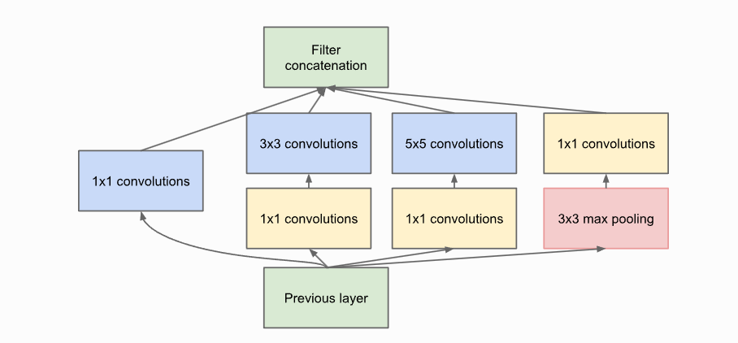
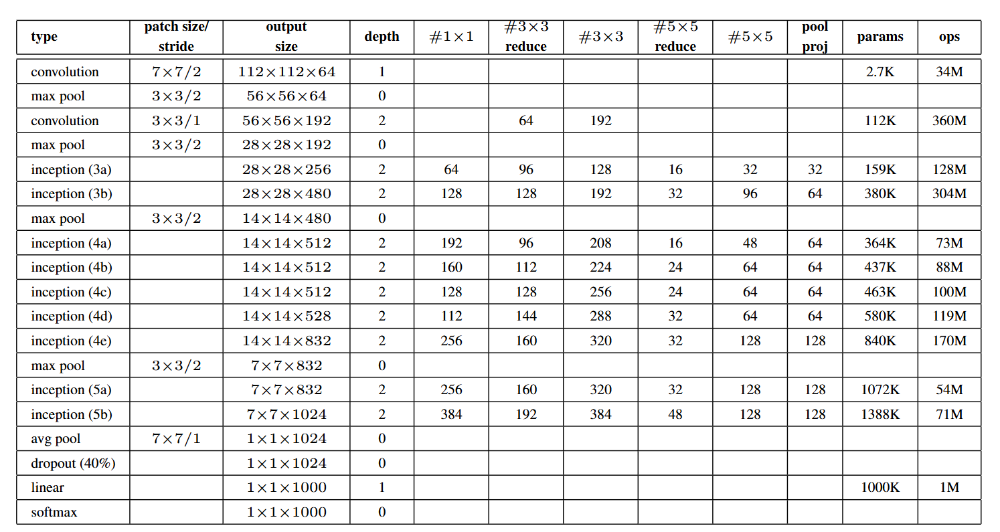
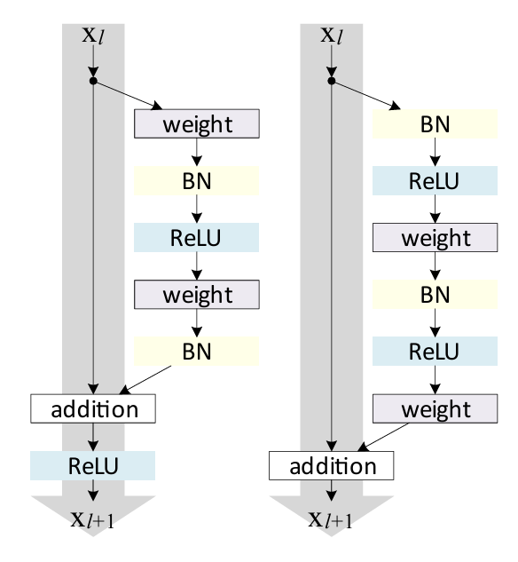
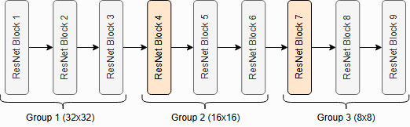
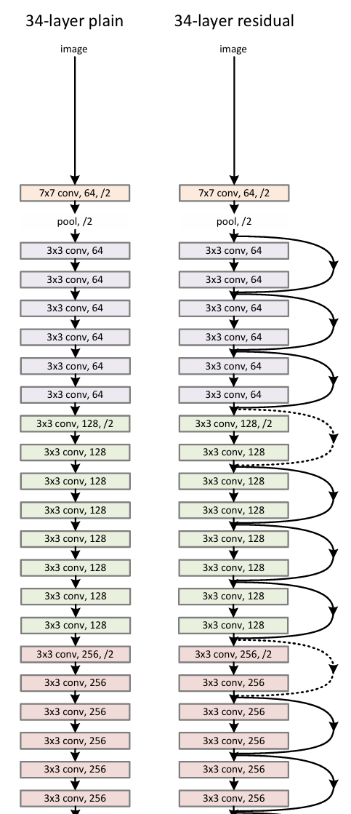
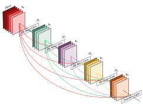
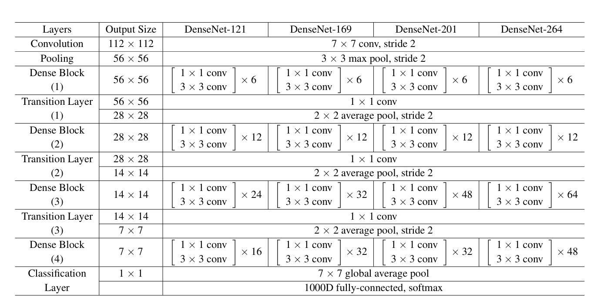
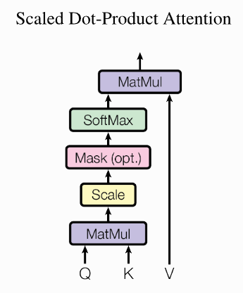
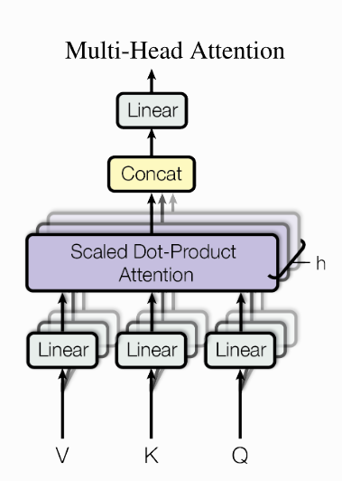
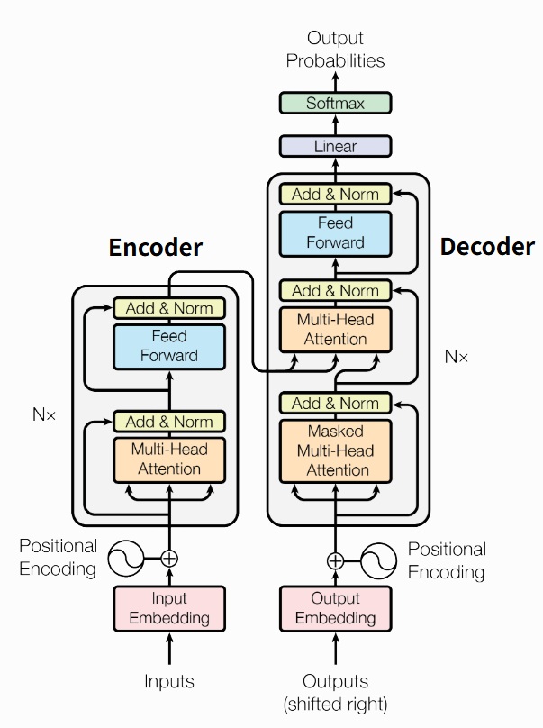

# **0** Back Propagation
上标表示层号,下标表示数据序号.  
First Input:  $ x_i^0 $  
Linear Output : $ z_i^p $  
Activation Output/Linear Input: $ x_i^p $  
Final Output: $ \hat{y} = x_i^l$  
Cost:   $ c = \frac{1}{N}\underset{i}{\Sigma}L(y_i,x_i^l) $其中L()是损失函数  
## Forward 
$$
z_i^1=W^1x_i^0+b^1  \quad  \quad x_i^1 = f^1(z_i^1) \\ 
\ldots \quad    \ldots \\ 
z_i^p=W^px_i^{p-1}+b^p \quad  \quad x_i^p = f^p(z_i^p) \\ 
\ldots \quad    \ldots \\ 
z_i^{p+1}=W^{p+1}x_i^p+b^{p+1} \quad  \quad x_i^{p+1} = f^{p+1}(z_i^{p+1}) \\ 
\ldots \quad    \ldots \\ 
z_i^l=W^lx_i^{l-1}+b^l \quad  \quad x_i^l = f^l(z_i^l) \\ 
$$
## Backward
$$
目标： \frac{\partial c}{\partial x^{l}}=\frac{1}{N}\underset{i}{\Sigma}\frac{\partial L}{\partial x^{l}}
$$
$$
\frac{\partial L}{\partial b^p}
=
\frac{\partial f^p(z^p)}{\partial z^p}
\cdot
\frac{\partial L}{\partial x^p}
$$
$$
\frac{\partial L}{\partial W^p}=
\frac{\partial L}{\partial z^p} (x^{p-1})^T=
\left(
\frac{\partial f^p(z^p)}{\partial z^p}
\cdot
\frac{\partial L}{\partial x^p}
\right)
(x^{p-1})^T
$$
$$
\frac{\partial L}{\partial x^p}
=
(W^{p+1})^T
\frac{\partial f^{p+1}(z^{p+1})}{\partial z^{p+1}}
\frac{\partial L}{\partial x^{p+1}}
$$
$$
\frac{\partial L}{\partial x^{l}}=L'(x^{l}, y)
$$
$$
注意,实际上所有的\frac{\partial f^p(z^p)}{\partial z^p} \quad 都只是f^p的一阶导函数 (f^p)'
$$
#  **1** Hello World
> --------------------------- Requirements ---------------------------  
torch                   2.5.1+cu121  
torchvision             0.20.1+cu121   
matplotlib              3.10.8  

> 本节的目标是实现一个xor的分类器   
为了使数据更复杂一些,这里的xor的data不只是(0,0) (0,1) (1,0) (1,1)这四个点,是以(0,0) (0,1) (1,0) (1,1)这四个点为中心,radius为半径随机的生成一些点  
## Pytorch Basic  
1. **数据集** 它指明了数据是什么 此处通过程序化生成,需要继承`Dataset` 并且重写 `__getitem__` 和 `__len__`这两个方法    
2. **模型**  需要继承`nn.Module`并且重写`forward`方法  
3. **DataLoader**  它指明了数据怎样喂给训练过程  
4. **nn.Module** 理解成一个输入tensor输出tensor的函数
5. **epoch**     表示把数据集完整的过一边。 
## Pytorch Tensor
- b==7, 是把index为7的位置都置为1。生成如[False,True,False,False,True]的tensor
- a[mask], mask is like[False,True,False,False,True]。它的作用是取a的第2个和第5个元素。
- a[idx], idx is like[1,4]。同上
- 注意 a[[0,1,0,0,1]]和上式不等价！
# **2** Miscellaneous Topics
## Pytorch Best Pratice
- 很多关于维度的参数，能用-1,-2就用-1,-2。而不是硬编码，因为有时候会忘记Batch这一个维度，导致你认为的dim不正确
## Activation Functions
1.  $\sigma(x) = \frac{1}{1 + e^{-x}}$  
2. $\tanh(x) = \frac{e^x - e^{-x}}{e^x + e^{-x}}$  
3. $\text{ReLU}(x) = \max(0, x)$
4. $
\text{LeakyReLU}(x) = 
\begin{cases} 
x & x > 0 \\
\alpha x & x \le 0
\end{cases}
$
5. $
\text{ELU}(x) = 
\begin{cases} 
x & x > 0 \\
e^x - 1 & x \le 0
\end{cases}
$  
6. $\text{Swish}(x) = x \cdot \sigma(x)$  
## Batch Normalization
如果某一层的激活函数之前的输入是(线性层之前的输出)是(m,n)  
其中m是batch中样本的数量,n是一个样本中特征的数量  
注意下面不同的i其实是batch中不同的样本  
$ \mu_B = \frac{1}{m}\sum_{i=1}^{m} x_i $  
$ \sigma_B^2 = \frac{1}{m}\sum_{i=1}^{m}(x_i - \mu_B)^2 $  
$ \hat{x}_i = \frac{x_i - \mu_B}{\sqrt{\sigma_B^2 + \epsilon}} $  
$ y_i​=γ\hat{x}_i​+β  $  
其中γβ是可学习参数,维度是(n)  
在推理时,没有batch的概念。$ \mu_B\quad\sigma_B $ 是训练时累计的 running mean / var     
## Layer Normalization
batch norm是不同样本之间同一个特征位置的normalization  
layer norm是同一个样本不同特征位置的normalization   
如数据的shape是 (B,C,H,W)  
Batch Normalization 会产生C个均值方差   
Layer Normalization 会产生B个均值方差      
一般CNN用batch norm,时序用layer norm. (这可以认为是实践总结得到的)  
# **3** CNN
- 结构总览:在图像的cnn里,输入的图像大小(这里不考虑batch)是(800,600,3),一般随着层数的增加,长宽维度会减小,而通道维度会增大。比如某一个中间层是(20,16,192),最终会是(1,1,1000).最后会跟着一个全连接层。    
- 优化器:动量sgd和adam都可以尝试。其中resnet可以用sgd。scheduler可以用MultiStepLR  ,它在指定的epoch降lr  
- Epoch number 数量级大概是100
## [GoogleNet](https://arxiv.org/pdf/1409.4842) 
是由如下的几个Inception模块堆叠而成的  
$$Inception$$

- 可以看到最后有concatenation操作,所以这四路的图片的长和宽要一致。所以3x3 5x5的那些层的padding要给'same'(pytorch自动计算出整数值以保证在stride为1的情况下长宽不变).  
- 别忘了在卷积层之后接BatchNorm之后再接激活函数  
$$Google Net$$

此网络可以分为3部分  
1. 第一个Inception之前。卷积层降尺寸
2. Inceptions. 期间穿插max pool降尺寸
3. 最后一个Inception之后。avg pool降到1x1.之后紧跟全连接。
## [ResNet](https://arxiv.org/pdf/1512.03385) 
对于隐藏层,res net之前的cnn: $y = F(x)$  
而res net:$ y = F(x) + x $  
其中，F(x)可以是一系列的conv maxpool avg relu等等     
所以,res net要求 x的shape(C,H,W)和F(x)的是相同的  
如果Shape不同，则 x可以过一个1x1 Conv再与F(x)相加(尺寸不同就调整stride)。此时，$ y = F(x) + W_sx $
$$ResNet Block$$
  
注:图中的|weight|表示Linear层  
res net有不同的变种,左边是初代res net。左右的最大区别在于激活函数的位置。  
$$ResNet$$
|    |  |
|--------|-----|
| 正如GoogleNet是Inception的串联 ResNet也是ResNetBlock的串联 其中,彩色的block表示发生了H,W的缩小(可以在第一个Linear层缩小)。      | 此图是resnet论文的真实例子 可以看到，每当图片尺寸H,W÷2时，通道数C就✖2。其他时候F(x)的(H,W,C)和x的是一致的  | 
## [DenseNet](https://arxiv.org/pdf/1608.06993) 
$$DenseNet Block$$
  
dense net比起res net更加激进，它在每一层的输出上都concatenate了之前各个层的输出。由于它是concat的(与res net的Add不同),它只要求输出的(H,W)与输入一致。即
$$\mathbf{x}_\ell = H_\ell \big( [\mathbf{x}_0, \mathbf{x}_1, \ldots, \mathbf{x}_{\ell-1}] \big)$$
超参数k={12,24,40...}  
Dense Net Layer: 即$H_\ell$的结构是BN-ReLU-Conv(1×1,4k)-BN-ReLU-Conv(3×3,k)  
Dense Block:由多个$H_\ell$串联而成  
Transition Layer:降低尺寸, Conv(1x1)-Avg(2x2,stride 2)
$$DenseNet$$
  
注意,Dense Net是先BN再Conv的，这点和一般的CNN很不同。  
所以input net(表格第一行Conv)的结构不是Conv-BN-ReLU,而是一个Conv.  
Classification net的结构也应该是BN起手的    
总之其他层的网络结构随着核心层的结构而变化  
# **4** [Transformer](https://arxiv.org/pdf/1706.03762) 
## Attention
Input $ (n \times d_m) $ (after position encoding) ：  $ \begin{bmatrix} x_1  \\ x_2 \\ x_3 \\ \vdots \\ x_T \end{bmatrix} $  
待学习的参数QKV三个矩阵  $\quad W^Q(d_m \times d_k) \quad W^K(d_m \times d_k) \quad W^V(d_m \times d_v) $  
分别与Sequence相乘  
| $Q(n \times d_k) $ |$K(n \times d_k) $ |$V(n \times d_v) $  |  $QK^T  (n \times n) $  |
|----------------|-------------------|------------|-------------|
|$ \begin{bmatrix} x_1^q  \\ x_2^q  \\ \vdots \\ x_n^q \end{bmatrix} $ |$ \begin{bmatrix} x_1^k  \\ x_2^k  \\ \vdots \\ x_n^k \end{bmatrix} $|$ \begin{bmatrix} x_1^v  \\ x_2^v  \\ \vdots \\ x_n^v \end{bmatrix} $|$ \begin{bmatrix} x_1^qx_1^{kT} & x_1^qx_2^{kT} & \dots x_1^qx_n^{kT} \\ x_2^qx_1^{kT} & x_2^qx_2^{kT} & \dots x_2^qx_n^{kT} \\   \vdots  &  \vdots  &  \vdots  \\ x_n^qx_1^{kT} & x_n^qx_2^{kT} & \dots x_n^qx_n^{kT} \end{bmatrix} $|  

$QK^T/=\sqrt{d_k}$    
对$QK^T$的每一行做softmax。
$\alpha_{1j} = \frac{x_1^qx_j^{kT}}{\sum_j e^{x_1^qx_j^{kT}}  }$  
Output $ (n \times d_v) \quad Output_i(第i行)= \sum_{j=1}^{n} A_{ij} \cdot x_j^v $.  
【ALL IN ALL】 $ Attention(Q,K,V) = softmax(\frac{QK^T}{\sqrt{d_k}})V  $  
|Attention Data Flow|Multi-head Attention|
|--|------|
|||

对于多头注意力,设待学习的QKV矩阵有h组,每一组的输出维度是$d_v$,h组拼接在一起就是$hd_v$。  
为了和输入维度$d_m$一致，要求要么$hd_v=d_m$;要么最后加一个Linear层(如右图最上面的Linear层)来对齐输入维度
## Scale
这里来讲讲为啥有$\sqrt{d_m}$的缩放。  
已知，对于独立分布的变量X,Y。有$D(XY) = D(X)D(Y) + D(X)[E(Y)]^2 + D(Y)[E(X)]^2$  
现在假设Q的每一行是 $(q_1,q_2,...,q_{d_k})  \quad q_i \sim \mathcal{N}(0,1)$  
现在假设K的每一列是 $(k_1,k_2,...,k_{d_k})  \quad k_i \sim \mathcal{N}(0,1)$  
则点成是 $\Sigma_i q_ik_i  \sim \mathcal{N}(0,d_k)$
## 位置编码
$PE_{(pos,i)} =
\begin{cases}
\sin\left( \frac{pos}{10000^{i/d_{model}}} \right), & \text{if } i \bmod 2 = 0 \\
\cos\left( \frac{pos}{10000^{(i-1)/d_{model}}} \right), & \text{otherwise}
\end{cases}$  
$i \in [0,d_{model-1}] \quad pos \in [0,n-1]$
## Encoder

整个encoder模块只有一个激活函数,在Feed Forward里  
原文章这样描述:$\text{FFN}(x) = \max\big(0, \, x W_1 + b_1 \big) W_2 + b_2$  
这里的Linear作用在每一个token上(shape:$d_m \rightarrow d_h$),第二个Linear需要把shape再转回来(以做残差连接)  
LayerNorm是对每个token做的
## 优化器和调度器  
Epoch number 数量级大概是10  
优化器可以用adam
调度器分为两个方面，分别是warm up+ cosine decay
warm up: iteration 0->M   ==>  learning rate: 一个很小的值-->优化器的设定值  
decay: iteration M->N  ==> learning rate:优化器的设定值-->一个很小的值  
具体来说:  
$warmup_{factor}=\frac{i}{M}$  
$decay_{factor} = 0.5*(1+cos(\frac{\pi i}{N}))$  
注意，iteration的单位是batch iteration(而不是epoch)  