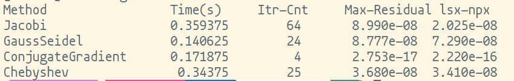
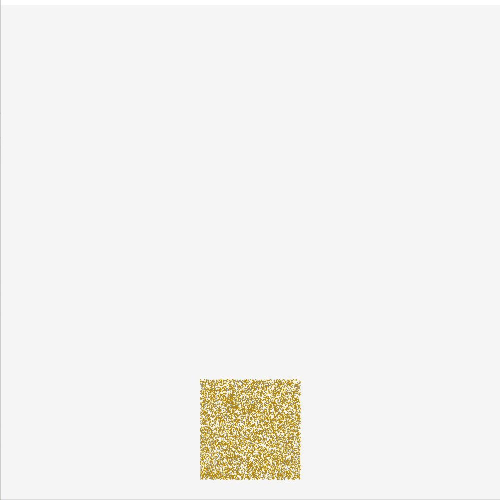
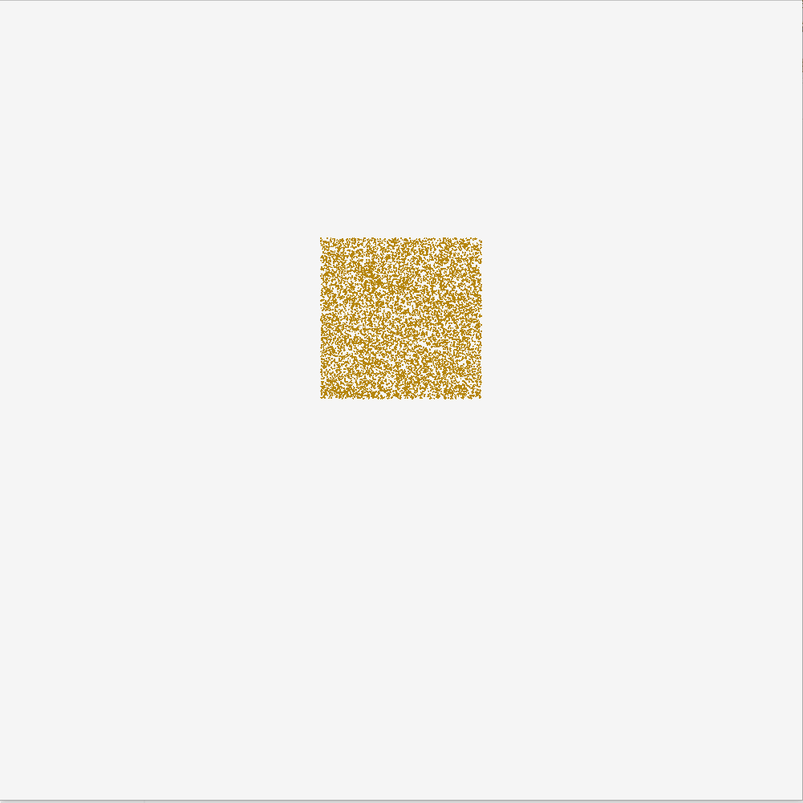
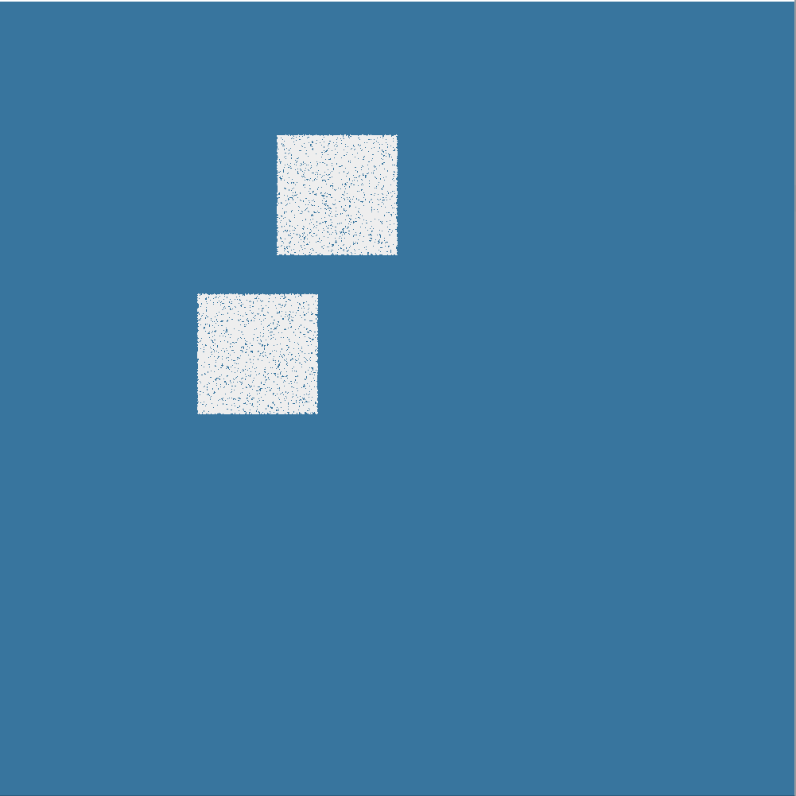
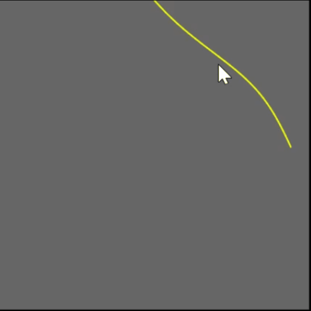

Python -- 3.8.10  
Taichi -- 1.0.4  

Linear Solver
- Jacobi
- Jacobi with Chebyshev acceleration
- Gauss-Seidel with Color Graphing
- Conjugate Gradient  
 

Linear Elastic FEM  
  

Implicit Mass Spring
- One Step Newton 
  - Baraff, D., & Witkin, A. (1998, July). Large steps in cloth simulation.
- Gradient descent with line search
- Newton's Method with fixed Positive Definite Hessian  
  
  
Fast Mass Spring
- Liu, T., Bargteil, A. W., O'Brien, J. F., & Kavan, L. (2013). Fast simulation of mass-spring systems.  
  

Pendulum  
    
  
Position Based Fluid with thermal conduction  
- Macklin, M., & Müller, M. (2013). Position based fluids.  
   
  
Material point method sand   
- Klár,G., Gast, T., Pradhana, A., Fu, C., Schroeder, C., Jiang, C., & Teran, J. (2016). Drucker-prager elastoplasticity for sand animation.  
(不确定这个仿真结果是否正确)  
  
  
  
Material point method snow  
- Stomakhin, A., Schroeder, C., Chai, L., Teran, J., & Selle, A. (2013). A material point method for snow simulation.  
  
  
XPBD Chain  
- Macklin, M., Müller, M., & Chentanez, N. (2016, October). XPBD: position-based simulation of compliant constrained dynamics.
- Müller, M., Bender, J., Chentanez, N., & Macklin, M. (2016, October). A robust method to extract the rotational part of deformations. 
  

Position Based Dynamics Rope    
- Müller, M., Heidelberger, B., Hennix, M., & Ratcliff, J. (2007). Position based dynamics.   
  
  
Ray Tracer  
  