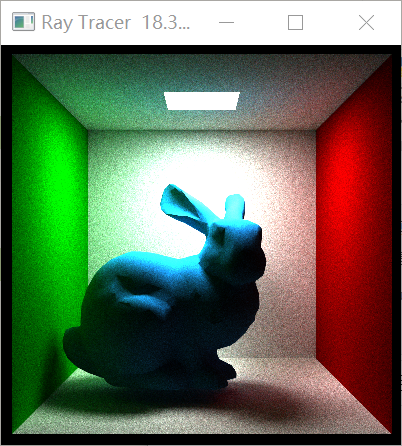
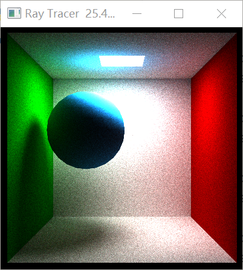
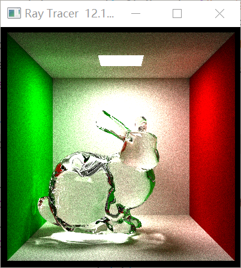
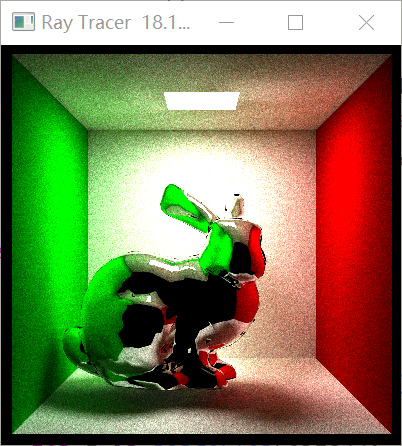
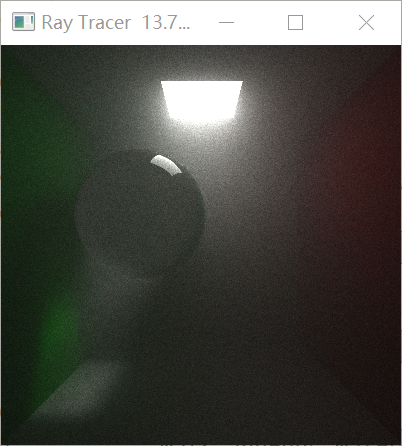
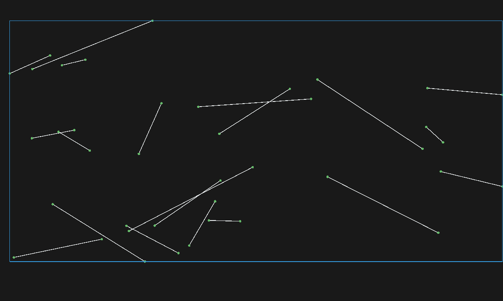

Python -- 3.8.10  
Taichi -- 1.6.0  

Linear Solver
- Jacobi
- Jacobi with Chebyshev acceleration
- Gauss-Seidel with Color Graphing
- Conjugate Gradient  
 

Optimization (ref-book:最优化：建模、算法与理论) 
## Unconstrained Optimization
- Line search:
  - Armijo
  - Wolfe
- Gradient Descent with line search
 
- Barzilar-Borwein with line search
 
- BFGS
 
- LBFGS
 
- Trust Region
 
- Gradient Descent with momentum and fixed learning rate
 
- Adam
 
## Constrained Optimization 
- Penalty (not visualize)
- Augmented Lagrangian (not visualize)

Linear Elastic FEM  
  

Implicit Mass Spring
- One Step Newton 
  - Baraff, D., & Witkin, A. (1998, July). Large steps in cloth simulation.
- Gradient descent with line search
- Newton's Method with fixed Positive Definite Hessian  
  
  
Fast Mass Spring
- Liu, T., Bargteil, A. W., O'Brien, J. F., & Kavan, L. (2013). Fast simulation of mass-spring systems.  
  

Pendulum  
    
  
Position Based Fluid with thermal conduction  
- Macklin, M., & Müller, M. (2013). Position based fluids.  
   
  
Material point method sand   
- Klár,G., Gast, T., Pradhana, A., Fu, C., Schroeder, C., Jiang, C., & Teran, J. (2016). Drucker-prager elastoplasticity for sand animation.  
(不确定这个仿真结果是否正确)  
  
  
  
Material point method snow  
- Stomakhin, A., Schroeder, C., Chai, L., Teran, J., & Selle, A. (2013). A material point method for snow simulation.  
- Jiang, Chenfanfu, et al. "The affine particle-in-cell method." ACM Transactions on Graphics (TOG) 34.4 (2015): 1-10.
  
  
XPBD Chain  
- Macklin, M., Müller, M., & Chentanez, N. (2016, October). XPBD: position-based simulation of compliant constrained dynamics.
- Müller, M., Bender, J., Chentanez, N., & Macklin, M. (2016, October). A robust method to extract the rotational part of deformations. 
  

Position Based Dynamics Rope    
- Müller, M., Heidelberger, B., Hennix, M., & Ratcliff, J. (2007). Position based dynamics.   
  
  
Continuous Collision
- Robust Treatment of Collisions, Contact and Friction for Cloth Animation  
- Cubic equation solver (bisect)
- Vertex-Face Edge-Edge Collision 
  

Ray Tracer  
- SAH BVH
- Brdfs:
  -   Specular Model:  GGX Microfacet
  -   Diffuse  Model:  Lambert
  -   Mirror
  -   Glass
- Volume Path Tracer
- Importance Sampline:
  -   sampling cosine term
  -   sampling brdf term

  
  
  
  
  

2D surface area heuristic BVH  
  

# <a href="https://pbr-book.org/4ed/contents" target="_blank"> Physically Based Rendering </a>

## path tracer
| Cornell  | Anisotropic Microfacet | Multiple Importance Sampling  |
|:------:|:-----:|:-----:|
|     |    |   

## volume path tracer
| fog  | Jade Bunny | Explosion  |
|:------:|:-----:|:-----:|
|     |    |   

<a href="http://www.cse.yorku.ca/~amana/research/grid.pdf" target="_blank">A Fast Voxel Traversal Algorithm for Ray Tracing</a>  
| TestCase0  | TestCase1 |
|:------:|:-----:|
|     |   |

# Discrete Differential Geometry
| Tree-Cotree  | Generators | HarmonicBasis  |
|:------:|:-----:|:-----:|
|     |    |   |
|   |    |  |

## Hodge Decomposition
|  ω | dα | δβ  |
|:------:|:-----:|:-----:|
|     |    |   |

|  parallel vector | geodesics  |
|:------:|:-----:|
|     |    | 

## SpectralConformalParameterization
|  uv in 2d | uv encoded in vertex | uv encoded on face  |
|:------:|:-----:|:-----:|
|     |   |  |
|     |   |  |

Bezier and BSpline Curve  
  

Subdivision Curve  
  

Delaunay Triangluation  
  

Mean Value Coordinate  
  

Deformation Transfer 
- Deformation Transfer for Triangle Meshes 
  